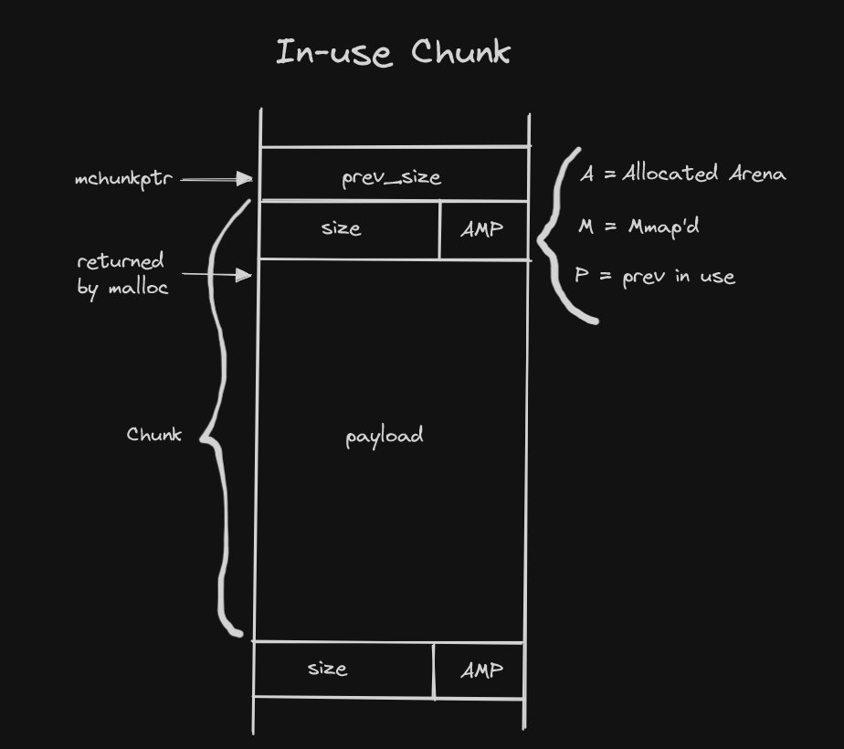

# C-MemoryAllocator

A custom memory allocator written in C.
- Simple and effective but not perfect

# Overview:
This allocator is a "heap" style allocator, which means that chunks of various sizes exist within a larger region of memory (a "heap") as opposed to, for example, an implementation that uses bitmaps and arrays, or regions of same-sized blocks, etc.
Some common terms:
- __Arena:__ A stucture that is shared among one or more threads which contains references to one or more heaps, as well as linked listd of chunks within those heaps which are "free".
- __Heap:__ A contiguous region of memory that is subdivided into chunks to be allocated. Each heap belongs to exactly one arena.
- __Chunk:__ A small range of memory that can be allocated, freed or combined with adjacent chunks into larger ranges. Note that a chunk is a wrapper that is given to the application. Each chunk exists in one heap and belongs to one arena.

# What is a Chunk?
Each chunk includes meta-dta about how big it is (via a size field in the chunk header), and thus where the adjacent chunks are. Also, the last word in a freed chunk contains a copy of the chunk size (with the three LSBs set to zeroes, vs the three LSBs of the size at the front of the chunk which are used for flags).
A "chunk pointer" or `mchunkptr` does not point to the beginning of the chunk, but to the last word in the previous chunk - i.e. the first field in `mchunkptr` is not valid unless you know the previous chunk is free.
Since all chunks are multiples of 8 bytes, the 3 LSBs of the chunk size can be used for flags. These three flags are defined as follows:
- __A (0x04)__
    Allocated Arena - the main arena uses the application's heap.
- __M (0X02)__
    MMap'd chunk - this chunk was allocated with a single call to `mmap` and is not part of a heap at all.
- __P (0X01)__
    Prev chunk in use - if set, the previous chunk is still being used by the application, and thus the `prev_size` field is invalid.

In order to ensure that a chunk's payload area is large enough to hold the overhead needed by the allocator, the minimum size of a chunk is `4*sizeof(void*)` (unless `size_t` is not the same size as `void*`)


Allocated heaps are always aligned to a power-of-two address. Thus, when a chunk is in an allocated heap, the address of the `heap_info` can be computed based on the address of the chunk:

Memory for allocated arenas is, conveniently, taken from the initial heap for that arena: 

__Quick Start__:
```
> make
> ./heap
```

__Limitations:__
- Works only on x86_64
- Works only when compiled with `gcc`
- The pointers to the heap can only be located in the heap and stack
- Doesn't work with packed structs
